# GDD Eclipsa
Eclipsa es un videojuego que está siendo desarrollado para la asignatura de Juegos en red por el grupo 08. A continuación se presenta el GDD del juego, el equipo de desarrollo y todos los aspectos interesantes. 

## Equipo de desarrollo

| Miembro del equipo | Correo oficial | Cuenta GitHub |
|-----------|-----------|-----------|
| Marianna Jiménez    | m.jimenez1.2022@alumnos.urjc.es    | mariannajimenezv   |
| Laura de la Cruz Cañadas    | l.delacruz.2022@alumnos.urjc.es    | ladeynn   |
| Gabriel Ernesto Mujica Proulx    | ge.mujica2025@alumnos.urjc.es    | gmujicap   |
| Samuel Retamero Salado    | s.retamero.2022@alumnos.urjc.es    | Samuelovich   |
| Laura Blázquez Pelaz    | l.blazquez.2022@alumnos.urjc.es    | lalachip7   |

# Índice
[1. Introducción](#1-introducción-definición-del-juego)   
[2. Monetización](#2-monetización)     
[3. Mecánicas del juego](#3-mecánicas-del-juego)     
[4. Historia y narrativa](#4-historia-y-narrativa)    
[5. Arte](#5-arte)    
[6. Interfaz](#6-interfaz)    
[7. Referencias](#7-referencias)    

# 1. Introducción: Definición del juego
## 1.1. Concepto del juego
Eclipsa es un juego de puzles cooperativo de plataformas 2D para dos jugadores, inspirado en la mecánica clásica de _Fireboy and Watergirl_, pero renovado con la dicotomía de la luz y la oscuridad. Los jugadores deben controlar simultáneamente a dos personajes, Nivia (la noche/oscuridad) y Solenne (el día/luz), para navegar por niveles llenos de trampas ambientales y puzles. El objetivo de cada nivel es recolectar los artefactos del sol y la luna para provocar el eclipse, restaurando el equilibrio cósmico. 

## 1.2. Género
El **género** del videojuego es de puzles cooperativos de plataformas 2D. El foco principal está en la resolución de puzles mediante la coordinación y el uso de las habilidades complementarias de los personajes. 

## 1.3. Propósito y público objetivo
El **propósito principal** es ofrecer una experiencia cooperativa desafiante y gratificante, fomentando la comunicación y el trabajo en equipo. Se busca revitalizar la fórmula de puzles de dos jugadores con un twist visual y temático fresco. 

El **público objetivo** serían jugadores casuales y mid-core, amantes de los juegos de puzles y plataformas 2D. Un público que disfruta de las experiencias de juego cooperativo local o en línea con amigos, parejas y familiares. 
Además, atraería también a fanáticos de juegos como _Fireboy and Watergirl_, _It Takes Two_ o _Portal 2_ (en su modo cooperativo).
El rango de edad contemplaría de 8 años en adelante, es decir, PEGI 3 o clasificación E, debido a la naturaleza no violenta y centrada en la lógica del juego. 

## 1.4. Plataforma y motor de juego
El videojuego está pensado para ser jugado en navegadores web de ordenadores, utilizando el **framework Phaser**, un motor de desarrollo de videojuegos 2D basado en JavaScript y HTML5.

## 1.5. Licencia
La **licencia** del videojuego es Apache 2.0, una licencia de código abierto que implica que los usuarios tienen libertad de usar, copiar y modificar el código del videojuego; redistribuir el software y su uso con fines comerciales, siempre y cuando den crédito a los autores.

# 2. Monetización
## 2.1. Modelo de negocio
El equipo piensa lanzar una versión del juego en la plataforma itch.io de manera gratuita para atraer a un mayor público. También se tendrá la posibilidad de apoyar a los desarrolladores con donaciones opcionales, con el precio recomendado siendo 2.00€. Se tendrá en cuenta la posibilidad de extender el juego a otras plataformas, si este logra ser exitoso y se le añade suficiente contenido.

## 2.2. Estrategia de marketing y comunicación
El marketing del juego estará enlazado directamente al éxito que logre Eclipsa, si consigue un gran seguimiento, se crearan cuentas en redes sociales como TikTok o Instagram para promocionar y compartir el desarrollo del juego, y de esa misma manera recibir _feedback_ de lo que les interese a los jugadores.

# 3. Mecánicas del juego
## 3.1. Objetivo
El objetivo de ambos jugadores en cada nivel es conseguir un cristal que corresponde a su símbolo - la Luna y el Sol. Para completar un nivel, los jugadores deben hacer contacto con el portal meta al final del nivel después de haber conseguido sus cristales. El juego consta de varios niveles, que son entornos 2D con plataformas, obstáculos, e ítems interactivos para completar el objetivo. Las mecánicas del juego tienen el propósito de fomentar la colaboración y la interacción entre ambos personajes, para que el objetivo solo se pueda conseguir si ambos jugadores trabajan en conjunto. 

## 3.2. Mecánicas
El juego se centra en la naturaleza complementaria de la Luz y Oscuridad, con ítems en el entorno que dependen de un personaje para ser activados o movidos. El movimiento de los personajes, sin embargo, es simple, pues solo involucra movimiento hacia los lados y un salto para navegar cada nivel. Con la intención de fungir como obstáculos para los jugadores, existen diferentes plataformas y barreras que hacen más complejo la resolución del juego: 
* Paredes marcadas con el Sol, la Luna, o un Eclipse, demarcando el personaje que es capaz de atravesarlas. Para las paredes de eclipse, solo pueden ser pasadas en cuanto el jugador consiga su cristal correspondiente.
* Switches que pueden ser activados por ambos o un personaje, para abrir alguna puerta que se encuentre en el nivel.
* Tras haber conseguido su cristal, cada personaje consigue la habilidad de interactuar con ciertos elementos (suelos, paredes, switches, plataformas, u otros ítems) para "ilumnarlos" y permitir la interacción. Mientras un personaje está iluminando, su movimiento es restringido. Existen a su vez plataformas que solo son activadas hasta que ambos personajes las iluminen.
* Cada entorno también tendrá abismos o trampas, que reiniciarán el nivel si alguno de los personajes cae.

Estas mecánicas sirven en conjunto para crear una experiencia multijugador compleja, que fomenta una comunicación y planificación entre los jugadores, y que también exige una destreza de navegación y movimiento para alcanzar el objetivo. 

## 3.3. Escenario
Los niveles serán niveles 2D, pero con una cámara estática que cubre todo el entorno. El desplazamiento de los personajes no afecta la cámara. Los niveles están ambientados en un bosque, con las plataformas parecidas a ramas y tierra, y con los elementos de juego interactivos más cercanos al diseño de Luz y Oscuridad de los personajes. 

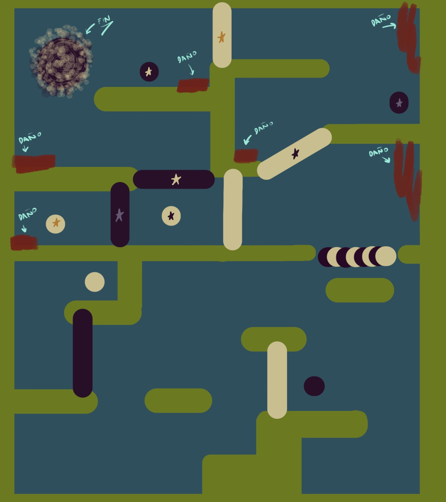

## 3.4. Controles y físicas
Las físicas del entorno son realistas: hay una gravedad constante, los ítems y obstáculos tienen peso y no se pueden atravesar, pero los saltos de los personajes se deberán sentir largos para el jugador. Como la temática del juego se centra en lo mágico e iluminado, habrá objetos flotantes, y el movimiento de los personajes se siente ligero y etéreo.

## 3.4.1. Modo local
Los jugadores controlan a sus personajes con el teclado, con un esquema diferente para cada uno:
* Uno utiliza WASD para moverse y E para interactuar. El jugador salta con la tecla W.
* Uno utiliza las flechas para moverse, y espacio para interactuar. El jugador salta con la tecla flecha arriba.

## 3.4.2. Modo en línea
Los jugadores controlan a sus personajes con el teclado, ambos con las mismas teclas en su dispositivo:
* Se utiliza WASD para moverse y E para interactuar. El jugador salta con la tecla W.

## 3.5. Niveles
EL juego constará de aproximadamente 6 niveles, que escalan en dificultad. Los primeros 2 serán para que los jugadores conozcan y se familiaricen con las mecánicas, en un entorno relajado en la entrada del bosque. Los siguientes 2 complican las mecánicas e introducen el resto, en un ambiente tenso en el bosque con más elementos mágicos. Los últimos niveles representan un desafío para los jugadores, donde deberán explorar las mecánicas más a fondo para completar el objetivo, en una parte del bosque donde los elementos de la luz y la oscuridad dominan todo. 

Todos los niveles serán construidos bajo la estructura mencionada; ambos jugadores deben encontrar el cristal de su símbolo, y reencontrarse el uno con el otro en el portal meta para pasar el nivel. En algunos casos, los niveles serán conformados por varias pantallas para que sean más largos y complejos. 

## 3.6. Objetos, armas y power ups
Aunque los personajes no tengan movimientos ni habilidades complejas, existen varios ítems entre los niveles que les permite interactuar con el mundo. 
* Switches para abrir y cerrar puertas.
* Los cristales simbólicos de cada personaje les permite "iluminar" algunos elementos.
* Cajas empujables para permitir a los jugadores acceder a lugares más altos.
* Puertas de Luz y Oscuridad. 

Como las habilidades de los personajes no cambian entre niveles y no existe progresión para los personajes fuera de estos, no existen power-ups que les brinden diferentes habilidades, con el propósito de mantener las mecánicas simples y fáciles de entender. 

# 4. Historia y narrativa
## 4.1. Historia y trama del videojuego
Durante años los espíritus han sido la raíz de la magia, pero según pasaron los años y los humanos destruían la naturaleza y los hábitats de los espíritus, estos fueron disminuyendo en número. Su valor y la magia que otorgaban se convirtió en el objetivo de personas poderosas que querían robarles los poderes mágicos a los espíritus. 

En el presente, atraparan a los espíritus de la luz y la oscuridad, Solenne y Nivia respectivamente, espíritus naturalmente opuestos, en una dimensión para que peleen y se debiliten mutuamente. Después de muchos combates se dan cuenta que la única manera de escapar es colaborando y encontrar la manera de desactivar el hechizo en el que están atrapados. 

## 4.2. Personajes
Tanto Nivia como Solenne son habitantes de un bosque encantado, y pese a ser de elementos opuestos, no tuvieron muchos conflictos, eso fue hasta que un mago poderoso usó la magia del bosque como medio para atrapar a los espíritus y forzarlos a que se peleen al estar en un ambiente más secluido.

# 5. Arte
## 5.1. Estética general
El juego utiliza un estilo vidual de color sólido sin lineart, donde las formas se definen por bloques de color y contraste, sin contornos dibujados. Este enfoque da una apariencia limpia, moderna y expresiva, enfocando la atención del jugador en el color y la composición más que en el detalle.

## 5.2. Apartado visual
El fondo tiene un predominio del verde, ya que el juego se desarrolla principalmente en un bosque.
Se usan tonos naturales como verdes, marrones y algunos azules para dar sensación de profundidad y tranquilidad.
Los colores se mantienen constantes dentro de cada entorno, pero varían ligeramente según el bioma, para diferenciar zonas como claros, cuevas o áreas más secas.

## 5.2.1. Personajes
Nivia y Solenne son opuestos complementarios. A nivel visual, su contraste genera equilibrio en la escena.

### Nivia
Nivia personifica la oscuridad. Su diseño tiene proporcionas más alargadas y puntiagudas, lo que nos da una sensación de misterio e intriga, lo que es ideal en la representación de la oscuridad. Sus colores son de un rango frío, centrándonos en una paleta de color pequeña para complementar el estilo seleccionado.

### Solenne
Solenne personifica la luz. Su diseño tiene formas redondas y suaves que contrastan con la silueta de Nivia, este diseño transmite calidez y apertura, perfecto para el concepto de luz. Su paleta de colores es de tonos cálidos, siendo un perfecto contraste de la paleta de Nivia. Nos centramos igualmente en una paleta más cerrada para complementar el estilo artístico seleccionado.

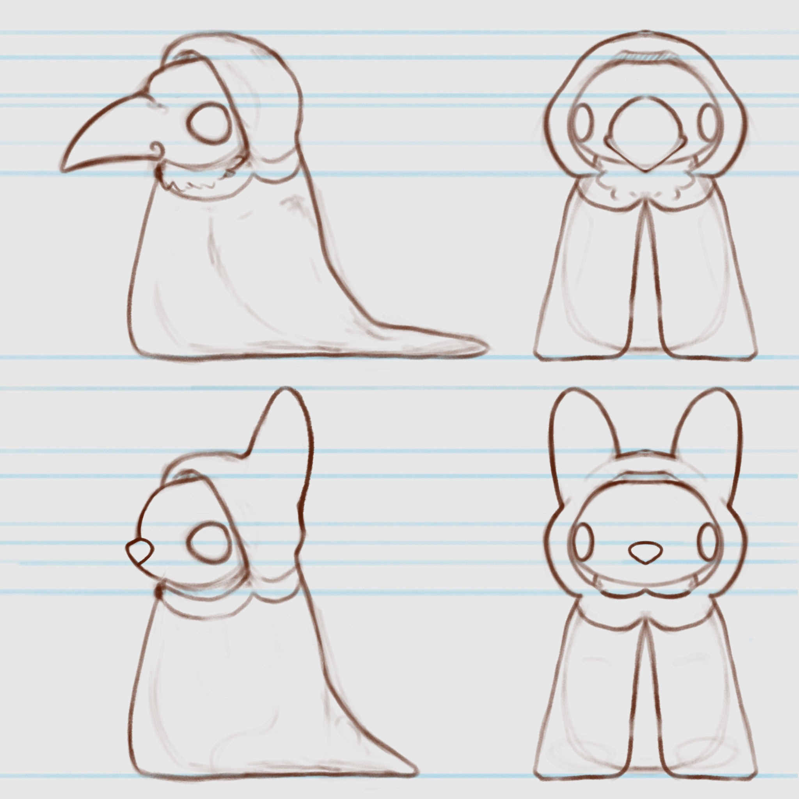

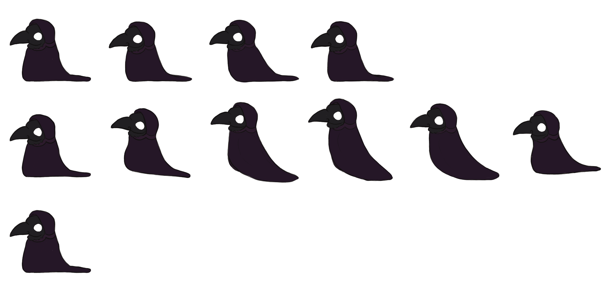
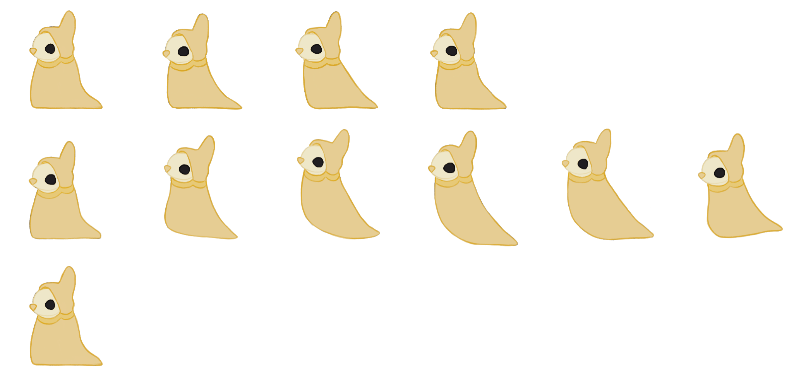

## 5.2.2. Entornos
El juego se desarrolla en el Bosque Eclipse, un espacio donde la naturaleza refleja el contraste entre la luz y la oscuridad. Es un entorno lleno de vida, niebla y misterio, donde los rayos del sol solo atraviesan ciertas áreas, creando zonas de luz y oscuridad. Aquí, Solenne y Nivia comienzan a comprender que solo trabajando juntas pueden avanzar: la luz revela caminos ocultos, mientras que la sombra permite cruzar lugares donde la energía solar resulta peligrosa.

En la paleta de colores dominan los verdes profundos, representando la vegetación, el musgo, las hojas… con azules oscuros, para dar la sensación de profundidad y oscuridad que los árboles producen. También tiene ciertos acentos de colores rojos  que aportan contraste visual para marcar al jugador el peligro.

En el escenario se puede encontrar plataformas naturales de tierra y cubiertas de césped que ayudan al jugador a escalar por el mapa y arboles por los que el jugador puede trepar usando sus ramas. Además, el jugador puede descubrir cuevas semi escondidas, que albergan secretos.

## 5.2.3. Ítems
El juego presenta dos ítems principales que representan los aspectos de luz y oscuridad. Los ítems siguen el mismo enfoque minimalista de los personajes y escenarios, usando color sólido sin lineart, formas claras y reconocibles. Para progresar en el nivel se tendrá que recuperar pequeños cristales que habilitarán nuevas secciones en el mapa. Por otro lado, para avanzar de nivel los jugadores deben de recuperar ambos ítems, la luna y el sol. Una vez reunidos, se combinan para formar un eclipse, símbolo visual de armonía entre luz y oscuridad. 

### Luna
Una media luna con un diseño simple y limpio, sin contornos, siguiendo el estilo visual del juego. Su paleta de colores refuerza la conexión de Nivia con la oscuridad, centrándonos en tonos fríos y oscuros.

### Sol
Un círculo radiante rodeado de otro círculo difuminado para dar la sensación de rayos de luz, manteniendo la simplicidad y ausencia de lineart. Conectando el objeto a Solenne, este contará con colores cálidos y brillantes, representando la luz y la claridad del personaje.

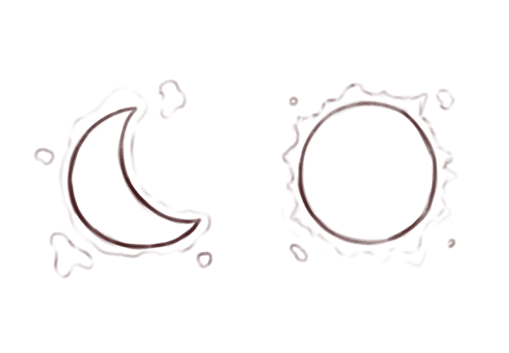
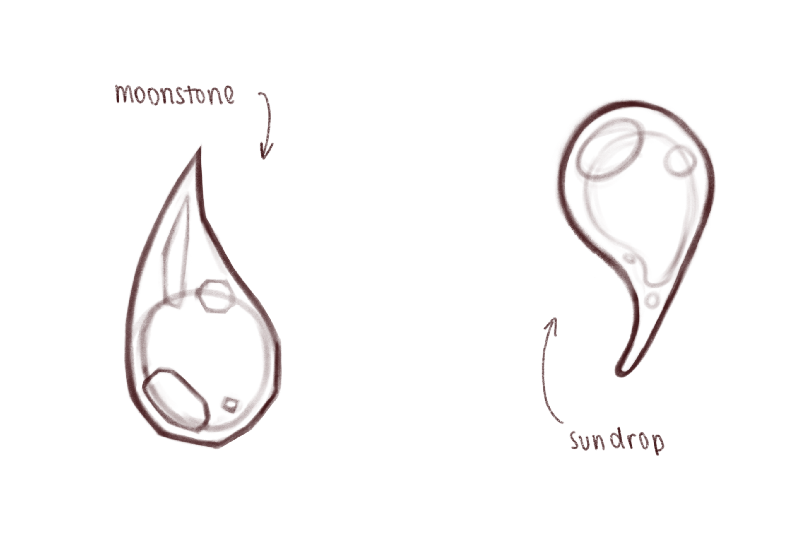
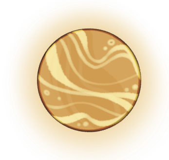

## 5.3. Música 

## 5.3.1. Banda sonora
En el juego se utilizan dos canciones, una para el menú de inicio y otra para cuando se esta jugando. En el menú de inicio se escucha la canción, lost-worlds-adventures por makesoundmusic. Esta contiene instrumentos de viento suaves y voces melódicas que evocan una emoción de nuevos comienzos y a la vez, da la sensación de un etorno místico. Por otro lado, en el juego se encuentra la canción carelessness, también por makesoundmusic. Esta tiene un tono mas alegre que la anterior, pero sigue utilizando esos instrumentos de vientos suaves, manteniendo la homogeneidad musical a lo largo del juego.

La banda sonora del videojuego busca reflejar la conexión entre la naturaleza, la luz y la oscuridad. Se componen de piezas que crean un ambiente melódico que acompaña el ritmo del jugador, creando una experiencia envolvente. El objetivo es que la música que esté en armonía con el entorno y los personajes. 
Los instrumentos que se usarán serán cuerdas suaves, percusión ligera y flautas mezclados con sintetizadores para representar la unión de la naturaleza con lo etéreo.

## 5.3.2. Efectos de audio
Los efectos de sonido ayudarán a reforzar la inmersión del jugador y comunicar lo que está pasando en pantalla de manera sonora. Todo diseño sonoro busca mantener la sensación de naturaleza y orgánica, mezclando los sonidos más sintéticos de cuando coges los ítems o avanzas con los puzles. En el juego podemos encontrar efectos de sonido cuando se recoge el moondrop y el sundrop. El primero hace un sonido de vacío frente al sonido de destello del segundo. Además se incluyo el sonido de los personajes al caminar por el césped.

# 6. Interfaz
La UI y el HUD de Eclipsa se diseñarán para ser mínimos, funcionales y altamente inmersivos. Se evitarán barras de salud o contadores innecesarios, ya que el juego se centra en el puzle y la muerte es instantánea por contacto con el elemento opuesto. 
La estética general integrará el diseño con el entorno: los elementos de la interfaz utilizarán tipografía rúnica y se presentarán con un estilo visual que emula hologramas etéreos o luz concentrada, reflejando la magia del bosque oscuro. Los colores dominantes serán los del espectro nocturno y crepuscular de Nivia (azul profundo, morado, negro) acentuados con el blanco de Solenne.

## 6.1. Menús 
### 6.1.1. Pantalla de inicio 
El fondo es una instantánea del bosque oscuro, donde se muestra a los dos protagonistas corriendo y la luna y el sol en un estado de eclipse parcial.
En cuando a la tipografía, el título utiliza una fuente minimalista y desordenada, con un efecto de brillo, y las opciones del menú principal, usan una fuente rúnica clara, dispuesta como si fueran runas flotando sobre una placa de piedra oscura. 
Además, al pasar el ratón o el cursor, la opción seleccionada se iluminará con un halo de luciérnagas.

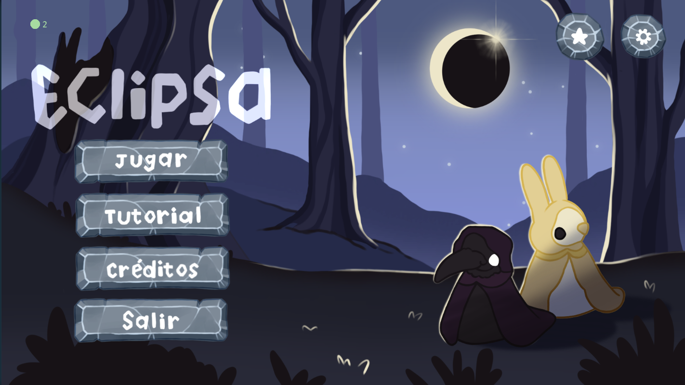

### 6.1.2. Pantalla de selección de nivel 
Se muestra un diagrama de constelaciones donde cada nivel es un punto brillante en el mapa, conectada por líneas de luz. Los niveles completados se muestran con un símbolo de sol y luna unidos (el Eclipse).
Al pasar el cursor sobre un nivel, se iluminará con el mismo halo de luciérnagas.

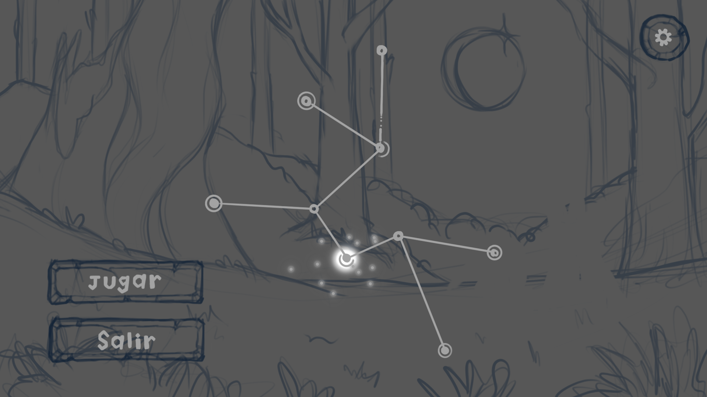
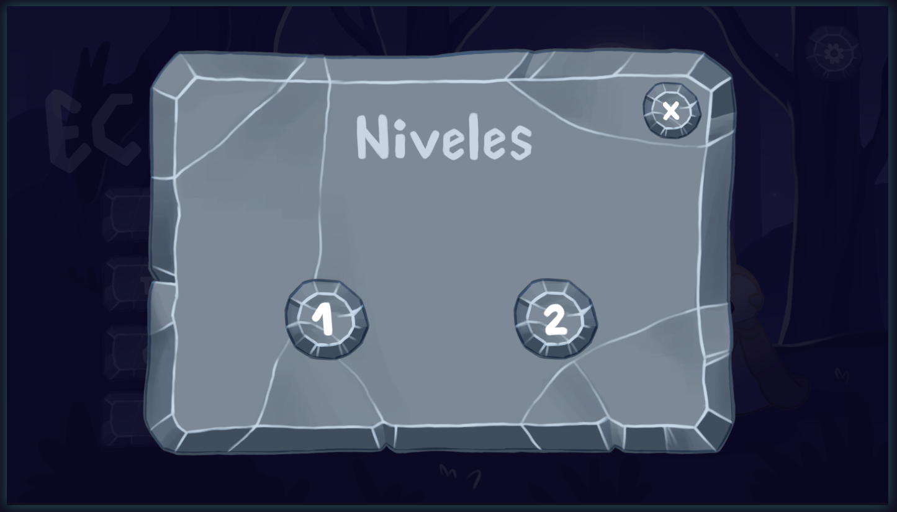

### 6.1.3. Pantalla del tutorial 
El tutorial se muestra como un guía rápida y visual de las reglas fundamentales del juego y está accesible desde el menú principal y el menú de pausa.
Se presenta como una antigua tablilla de piedra flotando sobre el bosque. Utiliza dibujos de estilo pictograma rúnico y colores primarios para comunicar las reglas al instante. 

### 6.1.4. Pantalla de créditos 
Se muestran los nombres de los desarrolladores del videojuego dispuestos en diferentes runas.

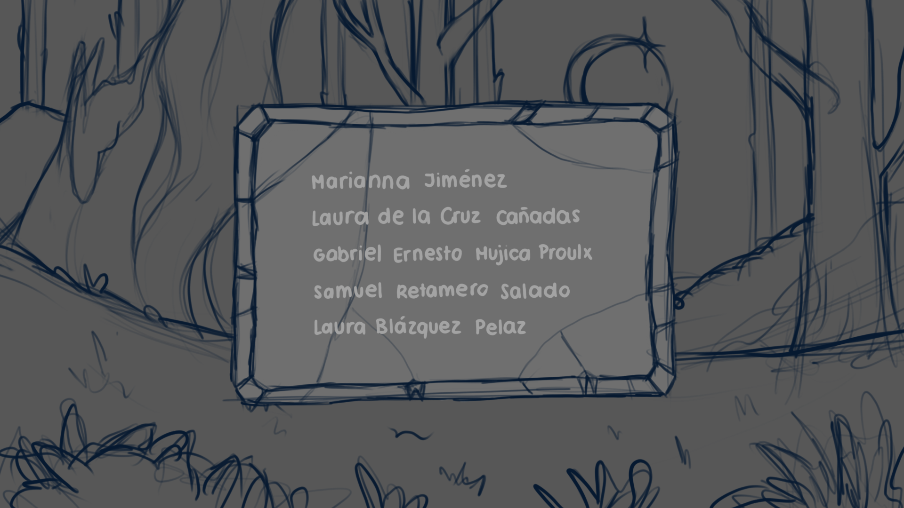
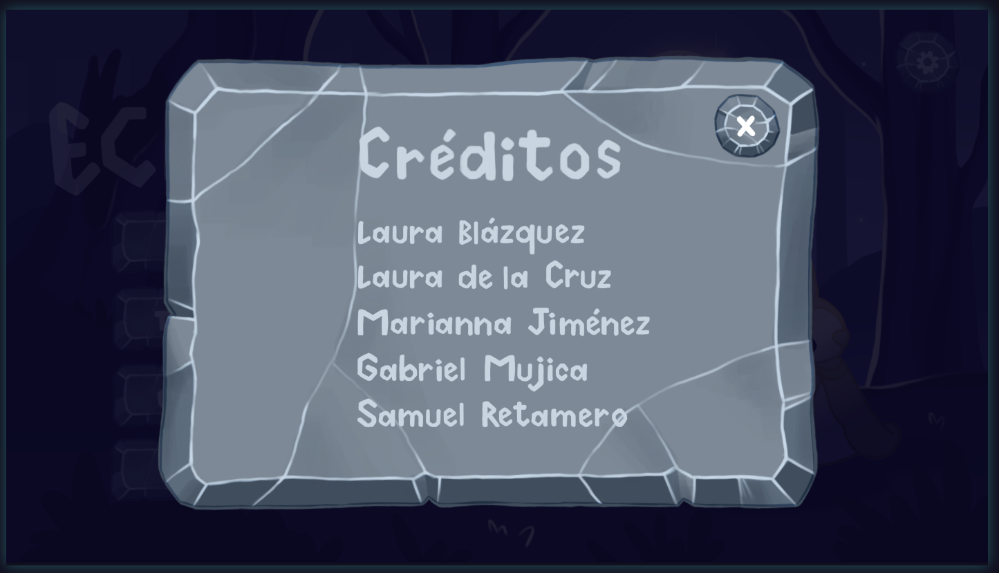

### 6.1.5. Pantalla del juego 
El HUD se mantendrá lo más despejado posible para no interferir con la resolución de puzles. 
En la parte superior derecha de la pantalla se mostrará un temporizador que indicará el tiempo restante para completar el nivel. 
En la parte superior central, aparecerán dos espacios vacíos flotantes sutilmente sobre el área de juego. Un espacio tendrá el icono estilizado de la luna menguante y el otro el del sol naciente. Cuando el personaje recoja su artefacto correspondiente, el icono se iluminará con una animación de brillo rúnico, confirmando la recolección. 
En la parte inferior derecha, aparecerá un indicador para abrir la ventana emergente del chat.

En el modo online, se mostrará en la esquina inferior izquierda un pequeño icono con el personaje que está controlando cada jugador. 

Cuando un personaje active un interruptor que cambie la iluminación del nivel, la pantalla tendrá un filtro:
* **Oscuridad:** la pantalla se satura más en tonos azules/negros, y los objetos visibles solo en la oscuridad se vuelven ligeramente traslúcidos y con contornos rúnicos.
* **Luz:** la pantalla se vuelve más brillante y cálida, y los objetos visibles solo en la luz se destacan con un halo suave y blanco.

### 6.1.6. Pantalla de game over 
* **Si se ha completado el nivel:** Aparece una animación en la que el sol y la luna se mueven el uno hacia el otro, formando el Eclipse, y aparecen los resultados (tiempo total transcurrido, puntuación...) y opciones para reintentar o volver a la selección de nivel.
* **Si uno de los personajes muere:** La pantalla se desvanece hacia un blanco cegador (si Nivia muere) o una oscuridad profunda y penetrante (si Solenne muere). Este efecto visual y de sonido enfatiza la ruptura del equilibrio. Aparece un texto flotante que dice "El equilibrio se ha roto" y las opciones para reiniciar el nivel o volver a la selección de nivel.
* **Si se acaba el tiempo:** Se muestra una imagen estática del bosque en desequilibrio, un texto flotante que dice "Se os ha acabado el tiempo" y las opciones para reiniciar el nivel o volver a la selección de nivel. 

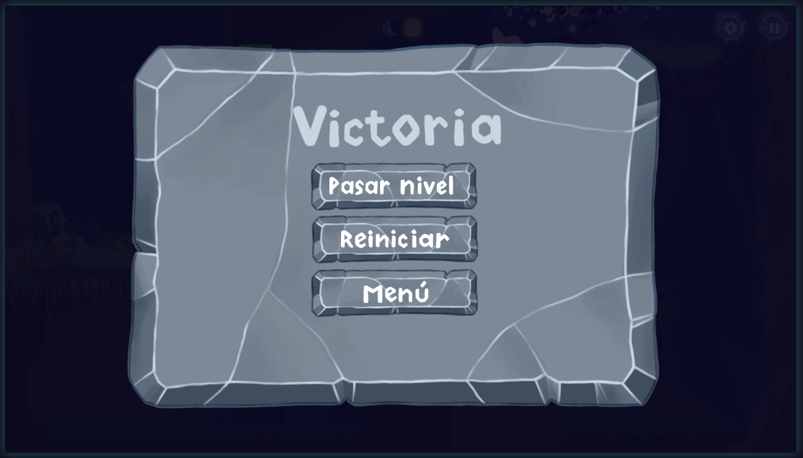
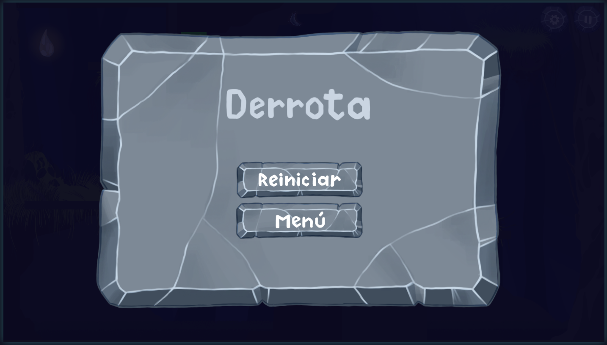

### 6.1.7. Pantalla de pausa y opciones 
El menú aparece como una superposición semitransparente sobre el juego. 
Aparecen los botones para: reanudar, reiniciar el nivel, acceder a las opciones y volver al menú principal. 
El diseño es simple, utilizando los mismos elementos rúnicos y de luz concentrada para los botones y deslizadores. 

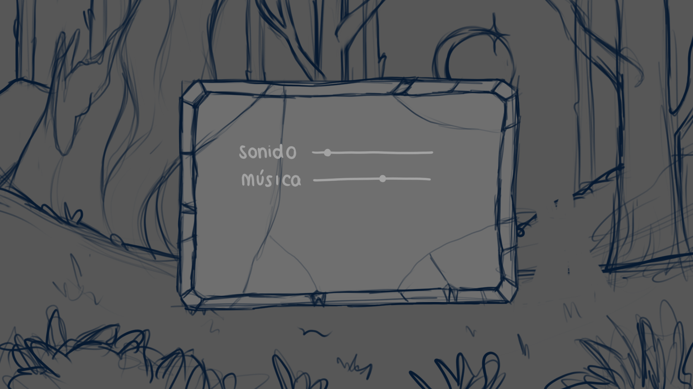
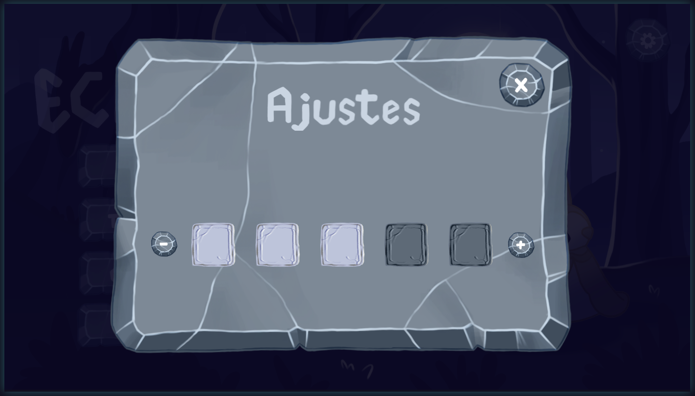
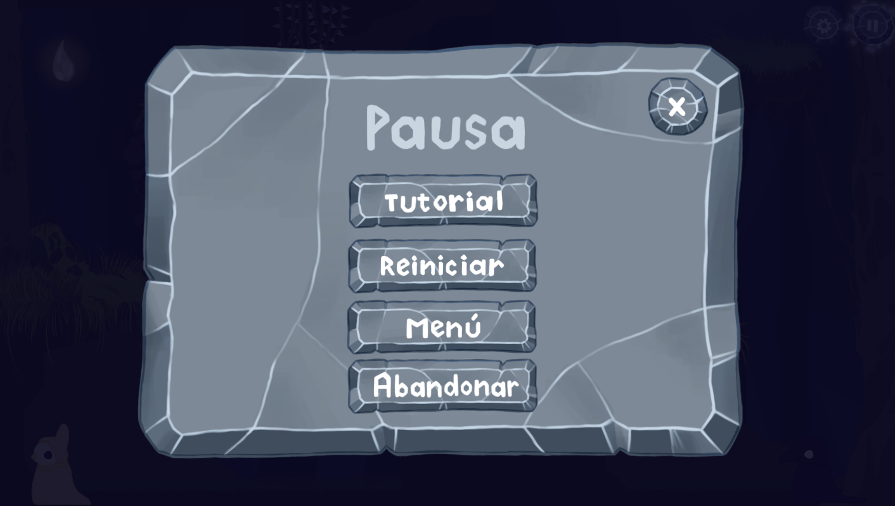

## 6.2. Diagrama de flujo 
El diagrama de flujo que se muestra a continuación ilustra la secuencia lógica de pantallas y la navegación del jugador desde el inicio del juego hasta la finalización de un nivel.

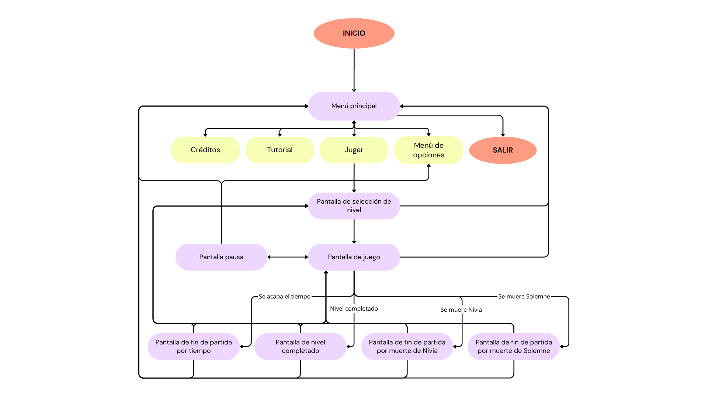

# 7. Referencias
Eclipsa referencia videojuegos como _Fireboy and Watergirl_, _Portal 2_ y _Ori and the Blind Forest_ en cuanto a su jugabilidad y a otros juegos como _Hollow Knight_ o los juegos de _Trine_, visualmente.

Estas son algunas de las imágenes que tomamos como referencia:
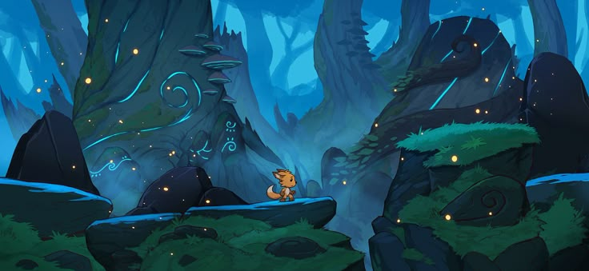
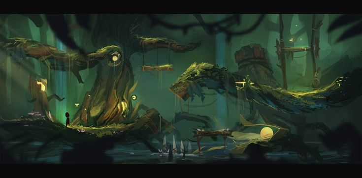
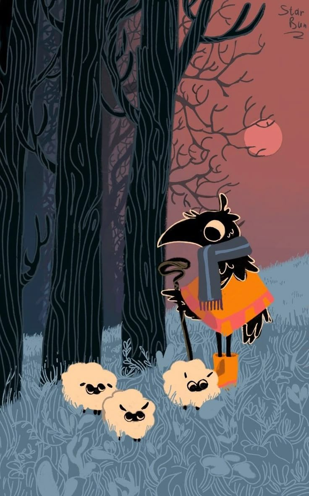
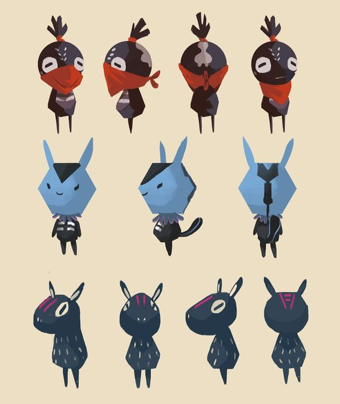
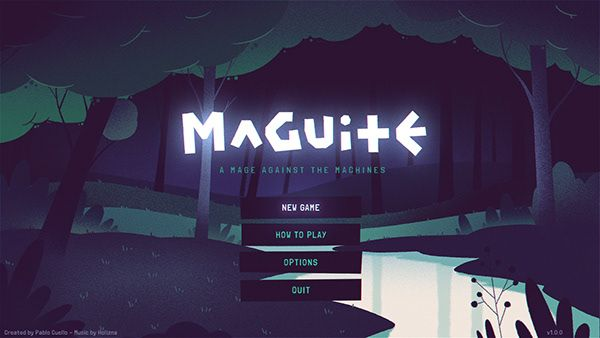
